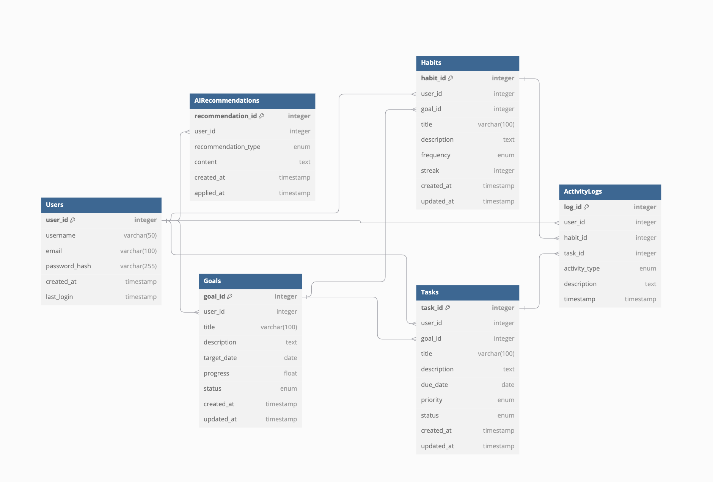

# AI-Powered Personal Life Assistant: Project Plan

## 1. Requirements

### 1.1 Functional Requirements

- **FR-1: Task Management**

  - Create, edit, delete tasks
  - Set title, description, due date
  - Prioritize and categorize
  - Track completion status

- **FR-2: Goal Tracking**

  - Create and manage goals
  - Associate tasks with goals
  - Track progress
  - Visualize goal status

- **FR-3: Habit Formation (Stretch Goal)**

  - Create and track habits
  - Monitor streaks
  - Set frequencies
  - View progress

- **FR-4: Data Synchronization**
  - Real-time updates
  - Offline capability
  - State management
  - Conflict resolution

### 1.2 Non-Functional Requirements

- **NFR-1: WASM Performance** (actual metrics TBD)

  - Component rendering < 100ms
  - State updates < 50ms
  - Bundle size < 2MB
  - Memory usage optimization

- **NFR-2: Real-Time Responsiveness** (actual metrics TBD)

  - WebSocket latency < 100ms
  - State sync < 200ms
  - Optimistic updates
  - Smooth animations

- **NFR-3: Offline Capability**
  - Full functionality without connection
  - Background sync when online
  - Local storage management
  - Conflict resolution

### 1.3 System Interface Requirements

1. Primary Interfaces:

   - Web Application Interface
     - Task management dashboard
     - Goal tracking view
     - Habit monitoring interface (stretch goal)
     - Activity history
   - Desktop Application Interface
     - Native system integration
     - Offline functionality
     - Local data synchronization

2. Supporting Interfaces:

   - Settings Panel (stretch goal)
     - User preferences
     - Notification settings
     - Integration settings
   - Analytics Dashboard (stretch goal)
     - Progress visualization
     - Habit statistics
     - Goal completion metrics
     - AI recommendation insights

### 1.4 Limitations

Boundaries or restrictions that cannot be overcome:

1. Technical Limitations

   - WASM current feature support
   - Local storage limits

2. Resource Limitations

   - No budget for paid services
   - Limited testing resources

3. Scope Limitations
   - Features must be achievable solo
   - Cannot support all possible platforms
   - No real-time collaboration features
   - Limited AI model customization (stretch goal)

### 1.5 Assumptions and Dependencies

#### Technical Assumptions

1. Development Environment

   - Rust and WebAssembly will perform adequately for the UI
   - Local storage will be sufficient for offline functionality

2. User Environment

   - Users have modern web browsers supporting WASM
   - Users have stable internet connection for AI features (stretch goal)
   - Users have sufficient device storage for local data

3. Performance Assumptions
   - Database queries will perform adequately at scale
   - WASM bundle size can be kept under 5MB (TBD)

#### Dependencies

1. External Dependencies

   - Tauri framework for desktop integration
   - PostgreSQL database system
   - GitHub for version control and CI/CD

2. Development Dependencies

   - Access to development tools and environments
   - Availability of testing devices/platforms
   - Access to AI model training resources (stretch goal)

3. Integration Dependencies
   - Compatibility between Rust and Python components
   - WebSocket support for real-time features
   - Browser support for required Web APIs

## 2. System Design

### 2.1 Architecture Overview

Frontend (Primary Focus):

- Rust/WASM with Yew
- Local state management
- WebSocket integration
- IndexedDB storage

Backend:

- Phoenix Framework
- Real-time channels
- PostgreSQL database
- RESTful API

Integration Layer:

- Type-safe contracts
- Binary serialization
- WebSocket protocols
- State synchronization

### 2.2 Data Flow

1. Local First:

   - User action → Local state
   - Optimistic update → UI
   - Background sync → Server

2. Real-Time Updates:
   - Server event → WebSocket
   - State update → Local store
   - UI refresh → Component

### 2.3 Components and Modules

#### 1. Frontend (Rust/WASM)

1.1 Core Components

- TaskList

  - Task item display
  - Status toggling
  - Priority handling
  - Goal association

- GoalDashboard

  - Progress tracking
  - Task association
  - Timeline view
  - Status updates

- HabitTracker

  - Streak display
  - Check-in system
  - Frequency management
  - Progress visualization

    1.2 State Management

- AppState

  - Global state container
  - Real-time sync handling
  - Offline state management

- LocalStorage

  - IndexedDB wrapper
  - Cache management
  - Sync queue

    1.3 Service Layer

- ApiClient

  - REST endpoints
  - WebSocket handling
  - Error management

- SyncManager
  - State synchronization
  - Conflict resolution
  - Offline queue

#### 2. Backend (Phoenix)

2.1 Controllers

- TaskController

  - CRUD operations
  - Validation logic
  - Response formatting

- GoalController

  - Progress tracking
  - Task associations
  - Status management

- HabitController

  - Streak calculations
  - Check-in handling
  - Frequency validation

    2.2 Channels

- TaskChannel

  - Real-time updates
  - Presence tracking
  - Event broadcasting

- SyncChannel

  - State synchronization
  - Client coordination
  - Offline recovery

    2.3 Context Modules

- Tasks

  - Business logic
  - Data validation
  - Event handling

- Goals

  - Progress calculation
  - Task management
  - Status updates

- Habits
  - Streak management
  - Frequency handling
  - Progress tracking

#### 3. Integration Layer

3.1 Data Contracts

- TypedRequests

  - Serialization
  - Validation
  - Error types

- WebSocketProtocols

  - Message formats
  - Event types
  - State sync

    3.2 Shared Utils

- DateHandling

  - Timezone management
  - Format consistency

- ValidationRules
  - Shared constraints
  - Error messages

### 2.4 Algorithms

[To be completed]

### 2.5 APIs

- RESTful API endpoints for CRUD operations
- WebSocket for real-time updates
- Authentication middleware (TBD)

### 2.6 Technology Stack

- Languages: Rust, WebAssembly, Python, Elixir
- Frameworks: Yew, Tauri, rust-bert, Actix/Phoenix
- Database: PostgreSQL
- Tools: Git, GitHub Actions

## 3. Database Design

### 3.1 Entity-Relationship Diagram



### 3.2 Database Schema

#### Common Types

- `id`: integer [primary key]
- `title`: varchar(100)
- `description`: text
- `created_at`: timestamp
- `updated_at`: timestamp

#### Enums

```elixir
enum Priority {
"High"
"Medium"
"Low"
}

enum Status {
"Not Started"
"In Progress"
"Completed"
"Archived"
}

enum Frequency {
"Daily"
"Weekly"
"Monthly"
"Custom"
}

enum ActivityType {
"Task_Complete"
"Goal_Progress"
"Habit_Check"
"System_Event"
}

enum RecommendationType {
"Task_Suggestion"
"Goal_Advice"
"Habit_Formation"
"Productivity_Tip"
}
```

### 3.3 Tables

1. Users
2. Tasks
3. Goals
4. Habits
5. ActivityLogs (stretch goal)
6. AIRecommendations (stretch goal)

#### Table Definitions

##### Users

| Column        | Type         | Constraints |
| ------------- | ------------ | ----------- |
| user_id       | id           | PK          |
| username      | varchar(50)  | unique      |
| email         | varchar(100) | unique      |
| password_hash | varchar(255) | not null    |
| created_at    | timestamp    | not null    |
| last_login    | timestamp    |             |

##### Tasks

| Column      | Type      | Constraints |
| ----------- | --------- | ----------- |
| task_id     | id        | PK          |
| user_id     | id        | FK          |
| goal_id     | id        | FK, null    |
| title       | title     | not null    |
| description | text      |             |
| due_date    | date      |             |
| priority    | Priority  | not null    |
| status      | Status    | not null    |
| created_at  | timestamp | not null    |
| updated_at  | timestamp | not null    |

##### Goals

| Column      | Type      | Constraints |
| ----------- | --------- | ----------- |
| goal_id     | id        | PK          |
| user_id     | id        | FK          |
| title       | title     | not null    |
| description | text      |             |
| target_date | date      |             |
| progress    | float     | default: 0  |
| status      | Status    | not null    |
| created_at  | timestamp | not null    |
| updated_at  | timestamp | not null    |

##### Habits

| Column      | Type      | Constraints |
| ----------- | --------- | ----------- |
| habit_id    | id        | PK          |
| user_id     | id        | FK          |
| goal_id     | id        | FK, null    |
| title       | title     | not null    |
| description | text      |             |
| frequency   | Frequency | not null    |
| streak      | integer   | default: 0  |
| created_at  | timestamp | not null    |
| updated_at  | timestamp | not null    |

##### ActivityLogs (stretch goal)

| Column        | Type         | Constraints |
| ------------- | ------------ | ----------- |
| log_id        | id           | PK          |
| user_id       | id           | FK          |
| habit_id      | id           | FK, null    |
| task_id       | id           | FK, null    |
| activity_type | ActivityType | not null    |
| description   | text         |             |
| timestamp     | timestamp    | not null    |

##### AIRecommendations (stretch goal)

| Column              | Type               | Constraints |
| ------------------- | ------------------ | ----------- |
| recommendation_id   | id                 | PK          |
| user_id             | id                 | FK          |
| recommendation_type | RecommendationType | not null    |
| content             | text               | not null    |
| created_at          | timestamp          | not null    |
| applied_at          | timestamp          |             |

### 3.4 Indexing Strategy

- Identify fields requiring indexing for performance optimization

### 3.5 Data Migration and Backup Strategy

- Regular automated backups
- Version control for schema changes

## 4. Project Plan

### 4.1 Project Management

- Tool: GitHub Projects for task tracking
- Weekly progress reports
- Bi-weekly advisor meetings

### 4.2 Timeline

1. Foundation (2 weeks)

   - Project setup
   - Basic architecture
   - Development environment

2. Core Features (6-8 weeks)

   - Task management
   - Goal tracking
   - Habit system
   - Basic UI

3. Integration (4-5 weeks)

   - Real-time sync
   - Offline support
   - Error handling
   - Performance tuning

4. WASM Innovation (6-8 weeks)
   - Performance analysis
   - Optimization patterns
   - Integration experiments
   - Documentation

### 4.3 Milestones

1. Foundation Setup (2 weeks)
   Tasks:

   - Set up Rust/WASM development environment ✅
   - Initialize Phoenix project structure ✅
   - Configure database and migrations
   - Establish basic project architecture ✅
     Dependencies: None

2. Task Management Core (2-3 weeks)
   Tasks:

   - Implement task CRUD in Phoenix
   - Create task list component in WASM
   - Develop task forms and validation
   - Set up real-time updates
     Dependencies: Foundation Setup

3. Goal System Integration (2-3 weeks)
   Tasks:

   - Implement goal CRUD endpoints
   - Create goal dashboard component
   - Develop progress tracking
   - Integrate task-goal relationships
     Dependencies: Task Management Core

4. Habit Tracking System (2-3 weeks)
   Tasks:

   - Implement habit CRUD endpoints
   - Create habit interface components
   - Develop streak tracking
   - Set up check-in system
     Dependencies: Goal System Integration

5. Rich Features & Integration (2-3 weeks)
   Tasks:

   - Build main dashboard
   - Implement search/filter
   - Add data visualizations
   - Optimize performance
     Dependencies: Habit Tracking System

6. Offline Capabilities (2 weeks)
   Tasks:

   - Implement IndexedDB storage
   - Develop sync system
   - Handle offline state
   - Resolve conflicts
     Dependencies: Rich Features & Integration

7. WASM Innovation Deep-Dive (6-8 weeks)
   Tasks:

   - Performance Analysis (1-2 weeks)
     - Profile memory usage
     - Analyze render performance
     - Identify bottlenecks
   - Optimization Implementation (2-3 weeks)
     - Optimize identified patterns
     - Improve state management
     - Enhance component lifecycle
   - Integration Experiments (2-3 weeks)
     - Test WebSocket optimizations
     - Explore binary protocols
     - Improve API patterns
   - Documentation (1 week)
     - Document findings
     - Create pattern guides
     - Performance reports
       Dependencies: All previous milestones

8. Polish & Launch (2 weeks)
   Tasks:
   - Cross-browser testing
   - Performance benchmarking
   - Documentation completion
   - Deployment preparation
     Dependencies: WASM Innovation Deep-Dive

### 4.4 Risk Assessment

Primary Risks:

1. WASM Integration

   - Component performance
   - Memory management
   - Browser compatibility
     Mitigation: Early prototyping, continuous profiling

2. Real-Time Sync

   - State consistency
   - Conflict resolution
   - Network reliability
     Mitigation: Robust error handling, fallback strategies

3. Offline Support
   - Storage limitations
   - Sync complexity
   - Data integrity
     Mitigation: Clear sync strategy, comprehensive testing

## 5. Test Plan

### 5.1 Testing Strategy

- Unit Testing: Individual component testing
- Integration Testing: System interaction testing
- End-to-End Testing: Full workflow testing
- Performance Testing: Load and stress testing

### 5.2 Test Scenarios

#### 1. Component Testing

1.1 Task Management

- Create new task

  - Validate all fields
  - Test required fields
  - Check error states
  - Verify optimistic updates

- Edit existing task

  - Update all fields
  - Validate changes
  - Test real-time sync
  - Check state updates

    1.2 Goal Tracking

- Goal progress calculation

  - Task completion impact
  - Progress updates
  - Timeline accuracy
  - State consistency

- Goal-Task relationships

  - Association handling
  - Progress propagation
  - Status synchronization

    1.3 Habit System

- Streak calculation
  - Check-in recording
  - Streak maintenance
  - Break handling
  - Recovery scenarios

#### 2. Integration Testing

2.1 Real-Time Sync

- WebSocket connection

  - Connect/disconnect handling
  - Reconnection strategy
  - Event propagation
  - State recovery

- State Synchronization

  - Multiple client sync
  - Conflict resolution
  - Data consistency
  - Error recovery

    2.2 Offline Functionality

- State persistence

  - Local storage operations
  - Cache management
  - Data retrieval

- Sync recovery
  - Queue processing
  - Conflict handling
  - State merging

#### 3. Performance Testing

3.1 WASM Performance

- Component rendering

  - Initial load time
  - Update performance
  - Memory usage
  - CPU utilization

- State Management

  - Large dataset handling
  - Update propagation
  - Memory efficiency

    3.2 Network Performance

- API Response times

  - CRUD operations
  - Batch operations
  - Error scenarios

- WebSocket efficiency
  - Message throughput
  - Connection stability
  - Reconnection speed

#### 4. User Flow Testing

4.1 Core Workflows

- Task management flow

  - Creation to completion
  - Goal association
  - Priority changes

- Goal progress flow

  - Task completion impact
  - Progress visualization
  - Timeline updates

    4.2 Error Handling

- Network failures

  - Offline mode transition
  - Data preservation
  - Recovery process

- Validation errors
  - User feedback
  - State recovery
  - Data integrity

## 6. Deployment

### 6.1 Deployment Strategy

- Phased rollout: alpha → beta → public release
- Automated deployment via GitHub Actions
- Local-first architecture with cloud synchronization

### 6.2 System Requirements

- Modern web browser with WASM support
- Desktop OS: Windows 10+, macOS 10.15+, Linux
- Internet connectivity for AI features

# AI-Powered Personal Life Assistant: Project Plan

## 1. Requirements

### 1.1 Functional Requirements

- **FR-1: Task Management**

  - Create, edit, delete tasks
  - Set title, description, due date
  - Prioritize and categorize
  - Track completion status

- **FR-2: Goal Tracking**

  - Create and manage goals
  - Associate tasks with goals
  - Track progress
  - Visualize goal status

- **FR-3: Habit Formation**
  a

  - Create and track habits
  - Monitor streaks
  - Set frequencies
  - View progress

- **FR-4: Data Synchronization**
  - Real-time updates
  - Offline capability
  - State management
  - Conflict resolution

### 1.2 Non-Functional Requirements

- **NFR-1: WASM Performance**

  - Component rendering < 100ms
  - State updates < 50ms
  - Bundle size < 2MB
  - Memory usage optimization

- **NFR-2: Real-Time Responsiveness**

  - WebSocket latency < 100ms
  - State sync < 200ms
  - Optimistic updates
  - Smooth animations

- **NFR-3: Offline Capability**
  - Full functionality without connection
  - Background sync when online
  - Local storage management
  - Conflict resolution

### 1.3 System Interface Requirements

1. Primary Interfaces:

   - Web Application Interface
     - Task management dashboard
     - Goal tracking view
     - Habit monitoring interface
     - Activity history
   - Desktop Application Interface
     - Native system integration
     - Offline functionality
     - Local data synchronization

2. Supporting Interfaces:

   - Settings Panel
     - User preferences
     - Notification settings
     - Integration settings
   - Analytics Dashboard (stretch goal)
     - Progress visualization
     - Habit statistics
     - Goal completion metrics
     - AI recommendation insights

### 1.4 Limitations

Boundaries or restrictions that cannot be overcome:

1. Technical Limitations

   - WASM current feature support
   - Local storage limits

2. Resource Limitations

   - No budget for paid services
   - Limited testing resources

3. Scope Limitations
   - Features must be achievable solo
   - Cannot support all possible platforms
   - No real-time collaboration features
   - Limited AI model customization (stretch goal)

### 1.5 Assumptions and Dependencies

#### Technical Assumptions

1. Development Environment

   - Rust and WebAssembly will perform adequately for the UI
   - Local storage will be sufficient for offline functionality

2. User Environment

   - Users have modern web browsers supporting WASM
   - Users have stable internet connection for AI features (stretch)
   - Users have sufficient device storage for local data

3. Performance Assumptions
   - Database queries will perform adequately at scale
   - WASM bundle size can be kept under 5MB (TBD)

#### Dependencies

1. External Dependencies

   - Tauri framework for desktop integration
   - PostgreSQL database system
   - GitHub for version control and CI/CD

2. Development Dependencies

   - Access to development tools and environments
   - Availability of testing devices/platforms
   - Access to AI model training resources (stretch goal)

3. Integration Dependencies
   - Compatibility between Rust and Python components
   - WebSocket support for real-time features
   - Browser support for required Web APIs

## 2. System Design

### 2.1 Architecture Overview

Frontend (Primary Focus):

- Rust/WASM with Yew
- Local state management
- WebSocket integration
- IndexedDB storage

Backend:

- Phoenix Framework
- Real-time channels
- PostgreSQL database
- RESTful API

Integration Layer:

- Type-safe contracts
- Binary serialization
- WebSocket protocols
- State synchronization

### 2.2 Data Flow

1. Local First:

   - User action → Local state
   - Optimistic update → UI
   - Background sync → Server

2. Real-Time Updates:
   - Server event → WebSocket
   - State update → Local store
   - UI refresh → Component

### 2.3 Components and Modules

#### 1. Frontend (Rust/WASM)

1.1 Core Components

- TaskList

  - Task item display
  - Status toggling
  - Priority handling
  - Goal association

- GoalDashboard

  - Progress tracking
  - Task association
  - Timeline view
  - Status updates

- HabitTracker

  - Streak display
  - Check-in system
  - Frequency management
  - Progress visualization

    1.2 State Management

- AppState

  - Global state container
  - Real-time sync handling
  - Offline state management

- LocalStorage

  - IndexedDB wrapper
  - Cache management
  - Sync queue

    1.3 Service Layer

- ApiClient

  - REST endpoints
  - WebSocket handling
  - Error management

- SyncManager
  - State synchronization
  - Conflict resolution
  - Offline queue

#### 2. Backend (Phoenix)

2.1 Controllers

- TaskController

  - CRUD operations
  - Validation logic
  - Response formatting

- GoalController

  - Progress tracking
  - Task associations
  - Status management

- HabitController

  - Streak calculations
  - Check-in handling
  - Frequency validation

    2.2 Channels

- TaskChannel

  - Real-time updates
  - Presence tracking
  - Event broadcasting

- SyncChannel

  - State synchronization
  - Client coordination
  - Offline recovery

    2.3 Context Modules

- Tasks

  - Business logic
  - Data validation
  - Event handling

- Goals

  - Progress calculation
  - Task management
  - Status updates

- Habits
  - Streak management
  - Frequency handling
  - Progress tracking

#### 3. Integration Layer

3.1 Data Contracts

- TypedRequests

  - Serialization
  - Validation
  - Error types

- WebSocketProtocols

  - Message formats
  - Event types
  - State sync

    3.2 Shared Utils

- ValidationRules
  - Shared constraints
  - Error messages

### 2.4 Algorithms

N/A (TBD)

### 2.5 APIs

- RESTful API endpoints for CRUD operations
- WebSocket for real-time updates
- Authentication middleware (TBD)

### 2.6 Technology Stack

- Languages: Rust, WebAssembly, Python, Elixir
- Frameworks: Yew, Tauri, rust-bert, Actix/Phoenix
- Database: PostgreSQL
- Tools: Git, GitHub Actions

## 3. Database Design

### 3.1 Entity-Relationship Diagram


### 3.2 Database Schema

#### Common Types

- `id`: integer [primary key]
- `title`: varchar(100)
- `description`: text
- `created_at`: timestamp
- `updated_at`: timestamp

#### Enums

```elixir
enum Priority {
"High"
"Medium"
"Low"
}

enum Status {
"Not Started"
"In Progress"
"Completed"
"Archived"
}

enum Frequency {
"Daily"
"Weekly"
"Monthly"
"Custom"
}

enum ActivityType {
"Task_Complete"
"Goal_Progress"
"Habit_Check"
"System_Event"
}

enum RecommendationType {
"Task_Suggestion"
"Goal_Advice"
"Habit_Formation"
"Productivity_Tip"
}
```

### 3.3 Tables

1. Users
2. Tasks
3. Goals
4. Habits
5. ActivityLogs (stretch goal)
6. AIRecommendations (stretch goal)

#### Table Definitions

##### Users

| Column        | Type         | Constraints |
| ------------- | ------------ | ----------- |
| user_id       | id           | PK          |
| username      | varchar(50)  | unique      |
| email         | varchar(100) | unique      |
| password_hash | varchar(255) | not null    |
| created_at    | timestamp    | not null    |
| last_login    | timestamp    |             |

##### Tasks

| Column      | Type      | Constraints |
| ----------- | --------- | ----------- |
| task_id     | id        | PK          |
| user_id     | id        | FK          |
| goal_id     | id        | FK, null    |
| title       | title     | not null    |
| description | text      |             |
| due_date    | date      |             |
| priority    | Priority  | not null    |
| status      | Status    | not null    |
| created_at  | timestamp | not null    |
| updated_at  | timestamp | not null    |

##### Goals

| Column      | Type      | Constraints |
| ----------- | --------- | ----------- |
| goal_id     | id        | PK          |
| user_id     | id        | FK          |
| title       | title     | not null    |
| description | text      |             |
| target_date | date      |             |
| progress    | float     | default: 0  |
| status      | Status    | not null    |
| created_at  | timestamp | not null    |
| updated_at  | timestamp | not null    |

##### Habits

| Column      | Type      | Constraints |
| ----------- | --------- | ----------- |
| habit_id    | id        | PK          |
| user_id     | id        | FK          |
| goal_id     | id        | FK, null    |
| title       | title     | not null    |
| description | text      |             |
| frequency   | Frequency | not null    |
| streak      | integer   | default: 0  |
| created_at  | timestamp | not null    |
| updated_at  | timestamp | not null    |

##### ActivityLogs (stretch goal)

| Column        | Type         | Constraints |
| ------------- | ------------ | ----------- |
| log_id        | id           | PK          |
| user_id       | id           | FK          |
| habit_id      | id           | FK, null    |
| task_id       | id           | FK, null    |
| activity_type | ActivityType | not null    |
| description   | text         |             |
| timestamp     | timestamp    | not null    |

##### AIRecommendations (stretch goal)

| Column              | Type               | Constraints |
| ------------------- | ------------------ | ----------- |
| recommendation_id   | id                 | PK          |
| user_id             | id                 | FK          |
| recommendation_type | RecommendationType | not null    |
| content             | text               | not null    |
| created_at          | timestamp          | not null    |
| applied_at          | timestamp          |             |

### 3.4 Indexing Strategy

- Will identify fields requiring indexing for performance optimization (TBD)

### 3.5 Data Migration and Backup Strategy

- Regular automated backups
- Version control for schema changes

## 4. Project Plan

### 4.1 Project Management

- Tool: GitHub Projects for task tracking
- Weekly progress reports

### 4.2 Timeline

1. Foundation (2 weeks)

   - Project setup
   - Basic architecture
   - Development environment

2. Core Features (6-8 weeks)

   - Task management
   - Goal tracking
   - Habit system
   - Basic UI

3. Integration (4-5 weeks)

   - Real-time sync
   - Offline support
   - Error handling
   - Performance tuning

4. WASM Innovation (6-8 weeks)
   - Performance analysis
   - Optimization patterns
   - Integration experiments
   - Documentation

### 4.3 Milestones

1. Foundation Setup (2 weeks)
   Tasks:

   - Set up Rust/WASM development environment
   - Initialize Phoenix project structure
   - Configure database and migrations
   - Establish basic project architecture
     Dependencies: None

2. Task Management Core (2-3 weeks)
   Tasks:

   - Implement task CRUD in Phoenix
   - Create task list component in WASM
   - Develop task forms and validation
   - Set up real-time updates
     Dependencies: Foundation Setup

3. Goal System Integration (2-3 weeks)
   Tasks:

   - Implement goal CRUD endpoints
   - Create goal dashboard component
   - Develop progress tracking
   - Integrate task-goal relationships
     Dependencies: Task Management Core

4. Habit Tracking System (2-3 weeks)
   Tasks:

   - Implement habit CRUD endpoints
   - Create habit interface components
   - Develop streak tracking
   - Set up check-in system
     Dependencies: Goal System Integration

5. Rich Features & Integration (2-3 weeks)
   Tasks:

   - Build main dashboard
   - Implement search/filter
   - Add data visualizations
   - Optimize performance
     Dependencies: Habit Tracking System

6. Offline Capabilities (2 weeks)
   Tasks:

   - Implement IndexedDB storage
   - Develop sync system
   - Handle offline state
   - Resolve conflicts
     Dependencies: Rich Features & Integration

7. WASM Innovation Deep-Dive (6-8 weeks)
   Tasks:

   - Performance Analysis (1-2 weeks)
     - Profile memory usage
     - Analyze render performance
     - Identify bottlenecks
   - Optimization Implementation (2-3 weeks)
     - Optimize identified patterns
     - Improve state management
     - Enhance component lifecycle
   - Integration Experiments (2-3 weeks)
     - Test WebSocket optimizations
     - Explore binary protocols
     - Improve API patterns
   - Documentation (1 week)
     - Document findings
     - Create pattern guides
     - Performance reports
       Dependencies: All previous milestones

8. Polish & Launch (2 weeks)
   Tasks:
   - Cross-browser testing
   - Performance benchmarking
   - Documentation completion
   - Deployment preparation (stretch)
     Dependencies: WASM Innovation Deep-Dive

### 4.4 Risk Assessment

Primary Risks:

1. WASM Integration

   - Component performance
   - Memory management
   - Browser compatibility
     Mitigation: Early prototyping, continuous profiling

2. Real-Time Sync

   - State consistency
   - Conflict resolution
   - Network reliability
     Mitigation: Robust error handling, fallback strategies

3. Offline Support
   - Storage limitations
   - Sync complexity
   - Data integrity
     Mitigation: Clear sync strategy, comprehensive testing

## 5. Test Plan

### 5.1 Testing Strategy

- Unit Testing: Individual component testing
- Integration Testing: System interaction testing
- End-to-End Testing: Full workflow testing
- Performance Testing: Load and stress testing

### 5.2 Test Scenarios

#### 1. Component Testing

1.1 Task Management

- Create new task

  - Validate all fields
  - Test required fields
  - Check error states
  - Verify optimistic updates

- Edit existing task

  - Update all fields
  - Validate changes
  - Test real-time sync
  - Check state updates

    1.2 Goal Tracking

- Goal progress calculation

  - Task completion impact
  - Progress updates
  - Timeline accuracy
  - State consistency

- Goal-Task relationships

  - Association handling
  - Progress propagation
  - Status synchronization

    1.3 Habit System

- Streak calculation
  - Check-in recording
  - Streak maintenance
  - Break handling
  - Recovery scenarios

#### 2. Integration Testing

2.1 Real-Time Sync

- WebSocket connection

  - Connect/disconnect handling
  - Reconnection strategy
  - Event propagation
  - State recovery

- State Synchronization

  - Multiple client sync
  - Conflict resolution
  - Data consistency
  - Error recovery

    2.2 Offline Functionality

- State persistence

  - Local storage operations
  - Cache management
  - Data retrieval

- Sync recovery
  - Queue processing
  - Conflict handling
  - State merging

#### 3. Performance Testing

3.1 WASM Performance

- Component rendering

  - Initial load time
  - Update performance
  - Memory usage
  - CPU utilization

- State Management

  - Large dataset handling
  - Update propagation
  - Memory efficiency

    3.2 Network Performance

- API Response times

  - CRUD operations
  - Batch operations
  - Error scenarios

- WebSocket efficiency
  - Message throughput
  - Connection stability
  - Reconnection speed

#### 4. User Flow Testing

4.1 Core Workflows

- Task management flow

  - Creation to completion
  - Goal association
  - Priority changes

- Goal progress flow

  - Task completion impact
  - Progress visualization
  - Timeline updates

    4.2 Error Handling

- Network failures

  - Offline mode transition
  - Data preservation
  - Recovery process

- Validation errors
  - User feedback
  - State recovery
  - Data integrity

## 6. Deployment

### 6.1 Deployment Strategy

- Phased rollout: alpha → beta → public release
- Automated deployment via GitHub Actions
- Local-first architecture with cloud synchronization

### 6.2 System Requirements

- Modern web browser with WASM support
- Desktop OS: Windows 10+, macOS 10.15+, Linux
- Internet connectivity for AI features
